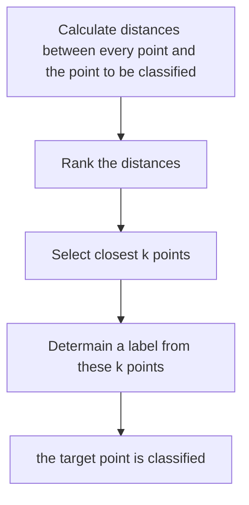

## Before Reading

This note is a quick go-through for basic ML / DL concepts, starting with linear regression. The outline of this note follows Huawei's HCCDP – AI certification.

[TOC]

## 1. Machine Learning Foundation

### 1.1 Overview

Regression is supervised learning, which means the output can be 'corrected' via certain loss function.

### 1.2 Regression

#### 1.2.1 **Univariate linear regression**

Input : $\{ (x_1,y_1),...,(x_n,y_n)\}$

Output: $y=ax+b$

Loss: $y_i = \epsilon_i + \sum_{j=1}^n w_jx_{i,j} =\epsilon_i + \boldsymbol{w}^\top \boldsymbol{x_i} \\$ , which means $\epsilon_i = y_i - \boldsymbol{w}^\top \boldsymbol{x_i}$ ①

The univariate linear regression **assume** that for every $x'$ that our regression function predicts, the actual corresponding $x$ will be located around it, in a **normal distribution** $P(x ; \mu, \sigma)$:

$$
P(x ; \mu, \sigma) = \frac{1}{\sqrt{2 \pi \sigma^2}}\exp{({-\frac{(x - \mu)^2}{2 \sigma^2}})} \\
$$

which means the error is in a normal distribution:

$$
P(\epsilon_i) = \frac{1}{\sqrt{2 \pi \sigma^2}}\exp{({-\frac{(\epsilon_i)^2}{2 \sigma^2}})} \\
$$

since $\epsilon_i = y_i - \boldsymbol{w}^\top \boldsymbol{x_i}$ ①, let $\mu = 0$:

$$
P(y_i|\boldsymbol{x_i}; \boldsymbol{w}) = \frac{1}{\sqrt{2 \pi \sigma^2}}\exp{({-\frac{(y_i - \boldsymbol{w}^\top \boldsymbol{x_i})^2}{2 \sigma^2}})} \\
$$

**Loss function**:

$$
L(\boldsymbol{w}) = L(\boldsymbol{w}; \boldsymbol{X}, \boldsymbol{y}) = \prod_{i=1}^{N}Pr(y_i|\boldsymbol{x_i}; \boldsymbol{w}) \\
 = \prod_{i=1}^{m} \frac{1}{\sqrt{2 \pi \sigma^2}}\exp{({-\frac{(y_i - \boldsymbol{w}^\top \boldsymbol{x_i})^2}{2 \sigma^2}})} \\
$$

where $\boldsymbol{w}$ is what the regression is looking for.

The max likelihood function of **loss function**:

$$
\begin{aligned} \ell(\boldsymbol{w}) &= \log\ L(\boldsymbol{w}) \\ & = \log \ \prod_{i=1}^{m} \frac{1}{\sqrt{2 \pi \sigma^2}}\exp{({-\frac{(y_i - \boldsymbol{w}^\top \boldsymbol{x_i})^2}{2 \sigma^2}})} \\ &= \sum_{i=1}^{m}\log[\frac{1}{\sqrt{2 \pi \sigma^2}}\cdot\exp{({-\frac{(y_i - \boldsymbol{w}^\top \boldsymbol{x_i})^2}{2 \sigma^2}})}] \\ &= \sum_{i=1}^{m}\log[\frac{1}{\sqrt{2 \pi \sigma^2}}] + \sum_{i=1}^{m}\log[\exp{({-\frac{(y_i - \boldsymbol{w}^\top \boldsymbol{x_i})^2}{2 \sigma^2}})}] \\ &= m\log{\frac{1}{\sqrt{2 \pi \sigma^2}}} - \frac{1}{2 \sigma^2}\sum_{i=1}^{m}(y_i - \boldsymbol{w}^\top \boldsymbol{x_i})^2 \end{aligned} \\
$$

Note: above process uses following rules:

$$
\log (ab) = \log(a) + \log(b) \\ \log_e (\exp(a)) = a \\
$$

Finally, the target function is:

$$
J(\boldsymbol{w})=\sum_{i=1}^{m}(y_i - \boldsymbol{w}^\top \boldsymbol{x_i})^2 \\
$$

#### 1.2.2 **Multivariable Linear Regression**

Like the process above, **assume** the formula is:

$$
h_\theta(X) = \theta_0+\theta_1x_1+\theta_2x_2+...
$$

And to define $X_0=1$ we can define $X$ as a vector with $n+1$ dimensions:

$$
h_\theta(X) = \Sigma_{i=0}^{n}\theta_ix_i=\theta^TX
$$

The target function is:

$$
J(\theta)=\frac{1}{2}\Sigma_{i=0}^m (\theta^Tx_i-y_i)^2=\frac{1}{2}(X\theta-y)^T(X\theta-y)
$$

#### 1.2.3 Optimization

- Least Square
- Batch Gradient Descent BGD
  - Update weights using all data (time consuming)
- Stochastic Gradient Descent SGD
  - Randomly select data to update weights
- Mini-Batch Gradient Descent MBGD

#### 1.2.4 **Logistic Regression**

The differences between logistic regression and linear regression challenge is whether the input is discrete or not. Discrete input, such like attributions of user, can be processed by logistic regression to classify corresponding labels.

Pros:

- Easy to implement
- Fast computing
- Provide probability score
- Can use L2 Regularization to deal with Multicollinearity

|                     | Linear Regression       | Logistic Regression                |
| ------------------- | ----------------------- | ---------------------------------- |
| Objective           | Prediction              | Classification(with probability)   |
| Function            | Fitting function        | Prediction Function                |
| Weights Calculation | Least squares method/GD | Maximum likelihood estimation, MLE |

Inference process based on a binary decision question, given the input:

$$
D={(x_{1}, y_{1}),(x_{2},y_{2}),\cdots,(x_{N}, y_{N})}, x_{i} \subseteq R^{n}, y_{i} \in {0,1},i=1,2,\cdots,N   \\
$$

which means the algorithm should output 0 or 1 for any given vector $x$.

In an ideal situation, we can have a trained weight $w$, and out put the score $z$ as the classification result, which passes following **Activation Function**(Heaviside step function)

$$
p(y=1 | x)=\begin{cases} 0,& z\lt 0 \\ 0.5,& z = 0\\ 1,& z\gt 0\ \end{cases} ,\quad z=w^T x+b  \\
$$

where the Heaviside step function is not negligible, we replace it with a similar function:

$$
y =  \frac{1}{1+e^{-z}}  \\=\frac{1}{1+e^{-(w^{T} x + b)}}  \\
$$

then:

$$
 ln \frac{y}{1−y} = w^{T}x + b \\
$$

**Let the $y$ to be the probability of the result as 1, and the $1-y$ as the probability of the result as 0.**

The fraction of these two probability (odds) is $\frac{1}{1-y}$ , which can replace the one in the above equation.

$$
ln(odds) = ln \frac{y}{1−y}  \\
$$

let $y$ to be the posteriori estimation, now the $z$ is:

$$
w^{T} x + b =z= ln\frac{P(Y=1|x)}{1-P(Y=1|x)} \\ P(Y=1|x) = \frac{1}{1+e^{-(w^{T} x + b)}} \\
$$

Note: Input is vector $x$, output is the label $Y$, score is $z$

Let:

$$
\begin{aligned} P(Y=1|x) &= p(x) \\  P(Y=0|x) &= 1- p(x) \end{aligned}\\
$$

Likelihood function (reward function):

$$
L(w)=\prod[p(x_{i})]^{y_{i}}[1-p(x_{i})]^{1-y_{i}}  \\
$$

$$
\begin{aligned} L(w)&=\sum[y_{i}lnp(x_{i})+(1-y_{i})ln(1-p(x_{i}))] \\ &=\sum[y_{i}ln\frac{p(x_{i})}{1-p(x_{i})}+ln(1-p(x_{i}))]  \\ &=\sum[y_{i}(w \cdot x_{i}) - ln(1+e^{w \cdot x_{i}})] \end{aligned} \\
$$

Loss function:

$$
J(w)=-\frac{1}{N}lnL(w) \\
$$

$$
J(w) =  -\frac{1}{n}(\sum_{i=1}^n(y_ilnp(x_i)+(1-y_i)ln(1-p(x_i))) \\
$$

### 1.3 Classification

```
Placeholder here
```

### 1.4 Supervised Learning

#### 1.4.1 KNN



Pros:

- Simple
- Applicable for non-linear classification
- No **Assumption** , not sensitive against noise data

Cons:

- Computation assuming
- Unbalanced issue
- Require large memory

#### 1.4.2 Naive-bayes

> If it is round and red, it should be an apple!

1. Determine attributions
2. Obtain training sample data
3. Calculate $P(y_i)$ for every label
4. Calculate every conditional probabilities for every label
5. The label with max $P(x|y_i)P(y_i)$ is the result.

Pros:

- Stable classification efficiency.
- Good performance in small scale data
- Suitable for text classification

Cons:

- Bad performance if attribution is too many or attributions are not well isolated
- Prior probability is required

#### 1.4.3 SVM

> Draw a line in the sky to divide stars.

- If the line works well, (stars are linearly separable), with a max hard margin, SVM is done.
- If the line works but few stars is in the wrong side, with a **max soft margin**, SVM is done.
- If the line doesn't works, we can use kernel function to project the flat sky into a high dimension dome, and SVM is done.

Pros:

- Nice robustness.
- Global optimization can be discovered.
- Suitable for small scale data.

Cons:

- Bad performance for large scale data
- Hard to deal with multi-label classification task
- Sensitive for missing data, args, and kennel function selection.

#### 1.4.4 Decision tree

Pros:

- Simple concept
- Input can be number or attribution
- Allow missing data

Cons:

- Overfitting
- Hard to predict consistent data

**Information Gain**

$$
IG(Y,X)=H(Y)-H(Y|X) \\
$$

**ID3** - using max info gain

1. For every attribution, calculate its Information Gain.
2. Select attribution with max information gain as first decision gate.
3. Repeat

**C4.5** - using gain ratio

In the C4.5 algorithm, the gain for a specific attribute is calculated using the normalized information gain. The gain for an attribute A is determined by subtracting the weighted average of the entropies of its partitions from the entropy of the original set.

1. Calculate the entropy of the original set.
2. Calculate the weighted average of the entropies of the partitions created by the attribute "Outlook."
3. Subtract the result from step 2 from the entropy of the original set to get the gain for the "Outlook" attribute.

This process is repeated for each attribute, and the attribute with the highest gain is selected as the splitting criterion.The gain ratio can also be calculated for each attribute, which takes into account the intrinsic information of an attribute. The gain ratio is calculated by dividing the gain by the split information.

**CART** - using Gini index

In every division, calculate the Gini index of proposed two sub-dataset (its pureness) and find best choice to get max pureness.

### 1.5 Unsupervised Learning

#### 1.5.1 K-means

1. Select **k** position as the centers of the aggregation.
2. For every data, calculate its distance between every center, select closest center as its label.
3. Update centers: The center of every data with this center as its label will be the new center.
4. If the center does not changes, provide the result

Cons:

- Can be effected by initial centers
- The k can be hard to determine
- Slow for large scale data
- Sensitive for noise and isolated data

#### 1.5.2 K-means++

Placeholder here

#### 1.5.3 K-medoids

Placeholder here

#### 1.5.4 Hierarchical Clustering

Placeholder here

#### 1.5.5 DBSCAN

Placeholder here

## 2. Deep Learning Foundation

### 2.1 Basic Knowledge of Neural Networks

#### 2.1.1 Perceptron

A perceptron is a basic building block of artificial neural networks, which are models inspired by the structure and functioning of the human brain. It was introduced by Frank Rosenblatt in 1957. A perceptron takes multiple binary inputs (0 or 1), applies weights to these inputs, sums them up, and passes the result through an activation function to produce an output (typically 0 or 1). Mathematically, the output (y) of a perceptron is calculated as follows:

$$
y = activation(\Sigma_{i=1}^n input\times weight_i+bias)
$$

#### 2.1.2 Activation Function

**Step Function:** It outputs 1 if the input is above a certain threshold and 0 otherwise. It's rarely used in hidden layers of modern neural networks but is sometimes used in the output layer for binary classification problems.

$$
\text{step}(x) = \begin{cases} 1 & \text{if } x > \text{threshold} \\ 0 & \text{otherwise} \end{cases}
$$

**Sigmoid Function (Logistic Function)**:It squashes the input values between 0 and 1, which is useful for binary classification problems.

$$
\text{sigmoid}(x) = \frac{1}{1 + e^{-x}}
$$

**Hyperbolic Tangent (tanh) Function:** Similar to the sigmoid, but it squashes input values between -1 and 1. It's often used in hidden layers of neural networks.

$$
\text{tanh}(x) = \frac{e^{x} - e^{-x}}{e^{x} + e^{-x}}
$$

**Rectified Linear Unit (ReLU):** It outputs the input directly if it is positive, and zero otherwise. ReLU is widely used in hidden layers due to its simplicity and effectiveness and **can mostly replace with Sigmoid**

$$
\text{ReLU}(x) = \max(0, x)
$$

**Softmax Function:** It is commonly used in the output layer of a neural network for multi-class classification problems. It converts a vector of raw scores into a probability distribution.

$$
\text{softmax}(x_i) = \frac{e^{x_i}}{\sum_{j=1}^{n} e^{x_j}}
$$

#### 2.1.3 Loss Function

**Mean Squared Error (MSE):** Used for regression problems, MSE calculates the average squared difference between predicted and actual values.

$$
\text{MSE} = \frac{1}{n} \sum_{i=1}^{n} (y_i - \hat{y}_i)^2
$$

**Binary Cross-Entropy Loss:** Commonly used for binary classification problems. It measures the dissimilarity between the predicted probabilities and the actual binary labels.

$$
\text{Binary Cross-Entropy} = -\frac{1}{n} \sum_{i=1}^{n} \left( y_i \log(\hat{y}_i) + (1 - y_i) \log(1 - \hat{y}_i) \right)
$$

**Categorical Cross-Entropy Loss:** Used for multi-class classification problems. It generalizes binary cross-entropy to more than two classes.

$$
\text{Categorical Cross-Entropy} = -\frac{1}{n} \sum_{i=1}^{n} \sum_{j=1}^{C} y_{ij} \log(\hat{y}_{ij})
$$

where $C$ is the number of classes, $y_{ij}$ is an indicator of whether class $j$ is the true class for sample $i$, and $\hat{y}_{ij} $is the predicted probability of sample $i$ belonging to class $j$.

**Hinge Loss:** Used for support vector machines (SVM) and some types of neural networks for binary classification.

$$
\text{Hinge Loss} = \max(0, 1 - y \cdot \hat{y})
$$

#### **2.1.4 Backpropagation**

**Error Back Propagation**

1. Back propagation loss to every computing unit
2. Update weight based on loss

### 2.2 Dataset Process

#### 2.2.1 **Data Partition**

Placeholder here

### 2.2.1 **Bias** & **Variance**

**High Bias**:

- Use larger model
- More training steps
- Alternative model
- Remediate regularization

**High Variance**:

- Obtain more data
- Add regularization
- Early stopping
- Alternative model

### 2.3 Network Design

### 2.4 Regularization

#### **2.4.1 Underfitting**

Reason:

- Lack of enough features

- Lack of complexity of model

Remediation:

- Add new features
- Add polynomial features
- Reduce regularization args
- Use non-linear model (kennel SVM, decision trees, etc.)
- Adjust model capacity
- Bagging

#### 2.4.2 **Overfitting**

Reason:

- Too many noise
- Less sample
- Model is too complex

Remediation:

- Reduce features
- Regularization

#### 2.4.3 Penalty

#### 2.4.4 **ℓ1-norm**

> https://en.wikipedia.org/wiki/Norm_(mathematics)#Definition

Also known as **Manhattan Distance or Taxicab norm**. L1 Norm is the sum of the magnitudes of the vectors in a space. It is the most natural way of measure distance between vectors, that is the sum of absolute difference of the components of the vectors. In this norm, all the components of the vector are weighted equally. Having, for example, the vector X = [3,4] :

$$
ℓ1-norm(X)=||X||_1=|3|+|4|=7
$$

L1-Regularization is actually adding a ℓ1-norm to the model:

$$
J(w;X,y)+\alpha||w||_1
$$

#### 2.4.5 **ℓ2-norm**

also known as the **Euclidean norm**. It is the shortest distance to go from one point to another.

$$
ℓ2-norm(X)=||X||_2=\sqrt{|3|^2+|4|^2}=\sqrt{9+16}=\sqrt{25}=5
$$

L2-Regularization is actually adding a ℓ2-norm to the model:

$$
J(w;X,y)+\frac{1}{2}\alpha||w||_2
$$

When ℓ1-norm and ℓ2-norm is set as Loss function, they are **least absolute deviation (LAD**) and **(least squares error, LSE)**.

#### 2.4.6 Dropout

#### 2.4.7 Pooling

### 2.5 Optimizer

#### 2.5.1 Gradient Descent

#### 2.5.2 Momentum

#### 2.5.3 Adam

#### 2.5.4 Optimizer Selection

| Data is sparse     | Self-adaption(Adagrad, Adadelta, RMSprop, Adam) |
| ------------------ | ----------------------------------------------- |
| Gradient is sparse | Adam is better than RMSprop                     |
| Summary            | Adam                                            |

### 2.6 Argument Adjustment

### 2.7 Convolution Neural Network

### 2.8 Recurrent Neural Network
